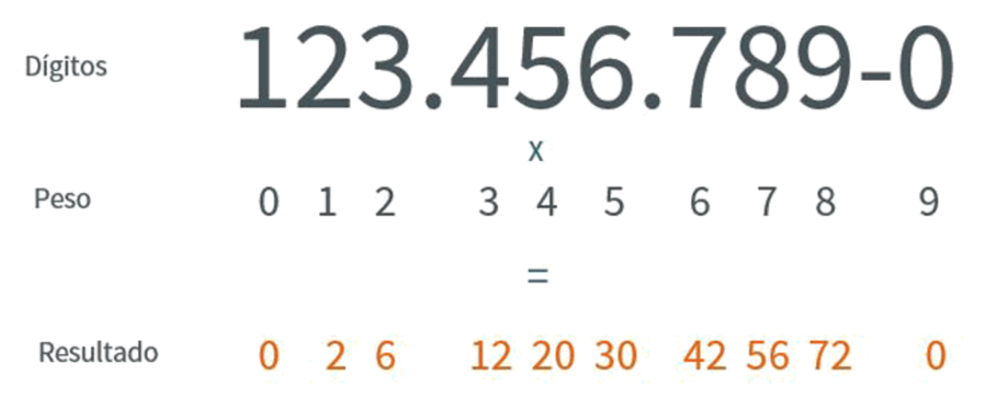
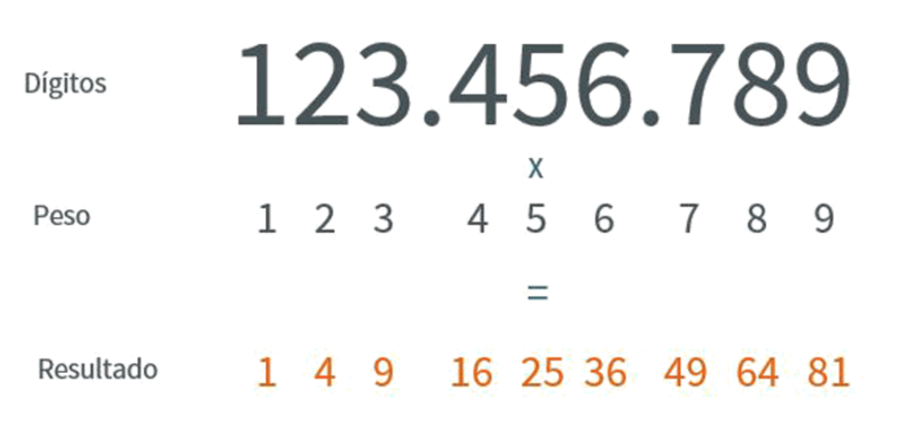

# Validador de CPF

Projeto desenvolvido no curso Full Stack da Gama Academy
  - Módulo Java Scrip básico.
#

### Passos para validar CPF
  - Calcular o primeiro dígito verificador utilizando os 9 primeiros dígitos do CPF;
  - Calcular o segundo dígito verificador utilizando os 9 primeiros dígitos e o primeiro dígito verificador;
  - Verificar se os 2 dígitos encontrados são iguais aos 2 últimos dígitos do CPF;
  - Se os dígitos calculados forem iguais aos dígitos fornecidos, então o CPF é válido;
  
  #### Esta forma de validação apenas verifica se o número de CPF é consistente, ou seja, pode ser fornecido para testes de software. Este método não confirma se um CPF é real e pertence a uma pessoa. 

#

### Como calcular os dígitos verificadores
Os dígitos verificadores de um CPF válido são calculados da seguinte forma:

  1. A partir dos 9 primeiros dígitos do CPF, multiplica-se cada dígito por um número, começando por 1 e incrementando para cada dígito. Para o CPF 123.456.789-09, ficaria assim:

  2. Soma-se todos os valores encontrados:
  
    - 1 + 4 + 9 + 16 + 25 + 36 + 49 + 64 + 81 = 285
  3. Divide-se essa soma por 11. O resto é o primeiro dígito verificador. Caso o resultado seja 10, usa-se 0 como dígito verificador.
  
    - 285 / 11 = 25
    - Resto = 10
    - Dígito = 0
  4. Agora, a partir dos 9 primeiros dígitos mais o primeiro dígito verificador calculado, multiplica-se cada dígito por um peso, começando por 0 e incrementando a cada passo. Seguindo nosso exemplo, ficaria assim:
  
  
  5. Novamente, soma-se todos os valores encontrados:
 
    - 0 + 2 + 6 + 12 + 20 + 30 + 42 + 56 + 72 + 0 = 240
  6. Divide-se o resultado por 11. O resto será o segundo dígito verificador. Se o resultado for 10, então 0 é usado como dígito verificador.
  
    - 240 / 11 = 21
    - Resto = 9
    - Dígito = 9
